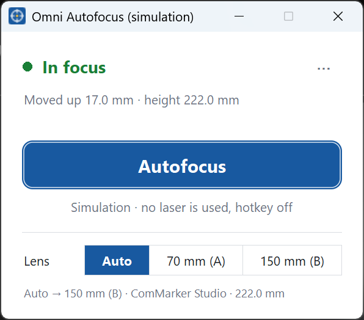

# Omni Autofocus

One-click autofocus for the **ComMarker Omni X / Xe** while you work in **LightBurn**. It reads the
machine's built-in height sensor through the laser controller and moves the motorised Z axis to the
focus height, using the same rules as ComMarker Studio plus a few safety and accuracy improvements.
ComMarker Studio is not needed.

> **Status:** working on real hardware (Omni Xe 6W). See
> [docs/hardware-testing.md](docs/hardware-testing.md) for what has been verified.



## Install

1. Download **`OmniAutofocus-Setup-<version>.exe`** from the Releases page and run it. No
   administrator rights are needed. Windows may say it "protected your PC" because the installer is
   not code-signed: click **More info → Run anyway**.
2. Leave **Start Omni Autofocus when Windows starts** ticked.
3. The Omni Autofocus window opens. Drag it next to LightBurn; it stays on top and remembers where you
   put it.

Requirements:

* **Windows 10 or 11** (64-bit). macOS and Linux are not supported yet: the tool reaches the laser
  through a Windows USB driver.
* The laser's **USB driver** (Cypress CyUSB3, shown as "Cypress FX2LP Sample Device"). LightBurn needs
  the same driver for this laser, so if LightBurn already talks to your Omni, you have it. Otherwise
  see [USB driver](#usb-driver).
* **ComMarker Studio closed** while you use the laser (it talks to the laser constantly). It does not
  need to be installed.

## Everyday use

1. Put the work piece under the head.
2. Press **Autofocus**, or **Ctrl+Alt+F** from anywhere (LightBurn can stay in front).
3. Wait for the green **In focus** (and a short chime), then start the job in LightBurn.

Good to know:

* **LightBurn can stay open and connected.** Close its framing/red-light preview first: while the
  preview or a job runs, the laser is busy and Omni Autofocus will not move Z.
* **Moving up never asks; a large move down asks first.** Up takes the head away from the work. A
  move down of more than 10 mm (towards the work) shows the numbers and waits for **Yes**.
* **The first time** you press Autofocus, the focus heights are read from the laser itself (ComMarker
  measures them at the factory). There is nothing to type in.
* If the sensor "sees no surface", the head is far from working height: bring it roughly there with
  the machine's Z buttons and press Autofocus again.

## Lenses

The Omni takes two field lenses, each with its own focus height. The window shows which lens it uses
and why. In **Auto** it follows LightBurn: the field size of your BSL device profile (the last-used
one, or the only one) picks lens A (70×70 mm) or B (150×150 mm). With one LightBurn profile per lens,
as LightBurn recommends for galvos, switching profiles switches the focus height. If LightBurn's
choice is not picked up, or you have no profile per lens, choose **Lens A** or **Lens B** in the
window. Without LightBurn, ComMarker Studio's lens setting is used.

## The ⋯ menu

| Item | What it does |
|---|---|
| Check height | Reads the sensor and shows how far Autofocus would move. Moves nothing. |
| Fine-tune focus (test burns) | Guided test burns to dial in a lens's focus height (see below). |
| Always on top | Keep the window above LightBurn. |
| Start with Windows | Start Omni Autofocus when you log in. |
| Check USB driver | Diagnoses the laser's USB connection and helps install the driver. |
| Open settings file | Opens the settings in your text editor (see [Settings](#settings)). |

## Fine-tuning focus

The factory focus heights are usually right (ComMarker also prints them on a card that ships with the
machine). To check or improve one, use **Fine-tune focus (test burns)** from the ⋯ menu or the Start
menu. It autofocuses, then steps Z from −4 to +4 mm, always moving up into each position so
lead-screw slack does not skew the result, and pauses at each step so you can burn the same small
test design in LightBurn. Use the lowest power that still marks: out-of-focus marks then fade, so the
edges of the good range are easy to see. At the end it asks for the lowest and highest label that
still looked good, and offers to save the middle of that range. Only the settings file on your PC
changes, never the laser.

## USB driver

**⋯ → Check USB driver** (or `omni-autofocus driver`) tells apart a missing laser, a missing driver
and the wrong driver, and says what to do:

* **Connected but no driver**: if Windows already has the driver (for example from an earlier
  ComMarker Studio install), unplug and replug the USB cable. If ComMarker's driver installer
  (`CypressDriverInstaller.exe`) is on this PC or on the USB stick that came with the laser, it offers
  to run it (Windows asks for administrator permission).
* **Connected with a different driver** (e.g. WinUSB after using Zadig): switch it back in Device
  Manager > Update driver > Browse my computer > Let me pick > "Cypress FX2LP Sample Device".

The driver's licence lets only hardware makers redistribute it, so Omni Autofocus cannot include it.
**Fallback that always works:** install ComMarker Studio for Windows from
[ComMarker's download center](https://commarker.com/download-center); its installer includes the
driver. You can keep Studio installed; just close it while using the laser.

## Settings

Settings live in `%APPDATA%\omni-autofocus\config.toml`, created on first use from the calibration
stored in your laser. Values are **sensor readings at best focus**, not lens-to-work distances.

| key | meaning |
|---|---|
| `focus.target_a_mm`, `focus.target_b_mm` | focus height of each lens (sensor reading) |
| `focus.offset_mm` | added to the focus height: a deliberate defocus or a global nudge |
| `focus.max_move_mm` | refuse larger single moves (default 60) |
| `focus.samples` | sensor readings per measurement (median, default 3) |
| `focus.field_a_mm`, `focus.field_b_mm` | lens field sizes used to recognise LightBurn profiles |
| `app.hotkey` | the global shortcut, e.g. `"ctrl+alt+f"` (letters, digits, F1–F12); `""` turns it off |
| `app.confirm_down_above_mm` | downward moves larger than this ask first (default 10) |
| `app.sounds` | chime when autofocus finishes (default `true`) |
| `z_axis.invert_direction` | flip Z direction if your machine moves the wrong way |

Restart the app after editing the file. From the command line: `omni-autofocus config show`,
`omni-autofocus config set focus.offset_mm 0.3`.

## Command line

The installer also puts `omni-autofocus.exe` next to the app (Start menu: *Fine-tune focus* and
*Check the laser's USB driver* use it). Double-clicking it runs `focus` in a console window.

```bash
omni-autofocus focus                # measure, confirm, move Z, re-check
omni-autofocus focus --dry-run      # only show the planned move
omni-autofocus focus-ladder         # fine-tune: test burns from -4..+4 mm, saves the best height
omni-autofocus height -n 5          # read the sensor (no motion)
omni-autofocus move-z 2.5           # relative Z move in mm (positive = up, away from the work)
omni-autofocus status               # controller state and Z position counter
omni-autofocus driver               # check the laser's USB driver and help install it
omni-autofocus calibration          # show the factory calibration stored in the laser
omni-autofocus set-focus --here     # make the current Z height this lens's focus (also: VALUE, --factory)
omni-autofocus app                  # open the Omni Autofocus window
omni-autofocus --simulate focus     # try everything against a built-in simulated laser
```

`-y` skips confirmation, `--lens a|b` picks the lens, `-v`/`-vv` add logging and raw USB frame dumps.
Exit codes: 0 in focus, 1 error or cancelled, 2 refused (out of range, safety limit), 3 moved but
still more than 0.5 mm from focus.

To set a lens's focus height by hand: `set-focus 222.5` (a value, e.g. from the card),
`set-focus --here` (the current Z is best focus), `set-focus --factory` (back to the laser's value).
Each shows old → new and asks before saving.

## Troubleshooting

* **"The laser is busy"**: a LightBurn job or the framing preview is running. Stop it, try again.
* **"sees no surface"**: the sensor measures 120–280 mm and gives the same answer for too near and too
  far. Bring the head to roughly working height with the machine's Z buttons.
* **"ComMarker Studio is running"**: close it (check the system tray too).
* **"counter moved … expected …"**: the controller did not execute the full move (stall, limit).
  Check the Z axis mechanically before trying again.
* **No laser found**: ⋯ → Check USB driver. If all else fails, install ComMarker Studio, which
  includes the driver.
* **The hotkey does nothing**: another program uses Ctrl+Alt+F (the window says so). Pick another in
  `app.hotkey` and restart the app.

## For LightBurn and other developers

* How it works, byte by byte: [docs/protocol.md](docs/protocol.md).
* Everything LightBurn would need to add native autofocus: [docs/lightburn-kit/](docs/lightburn-kit/).

## Development

```bash
python -m venv .venv
.venv\Scripts\python -m pip install -e ".[dev]"
.venv\Scripts\python -m pytest
.venv\Scripts\ruff check src tests && .venv\Scripts\ruff format --check src tests
.venv\Scripts\python -m pip install -e ".[build]"; powershell -File tools\build_exe.ps1
```

`build_exe.ps1` builds `dist\omni-autofocus.exe` (command line), `dist\OmniAutofocus.exe` (app) and,
with Inno Setup 6 installed (`winget install JRSoftware.InnoSetup`), the installer. Run the app
against the simulator with `omni-autofocus --simulate app`.

Layout: `framing.py` (USB frames) → `commands.py` (controller commands) → `controller.py`
(request/response, waits, verification) → `autofocus.py` (the focus loop) → `session.py` (settings,
first-run calibration, lens choice) → `cli.py` / `app.py`. `cyusb.py` is the Windows USB transport
(stdlib `ctypes` only), `driver.py` the driver check, `simulator.py` a fake controller used by tests
and `--simulate`.

## Credit and licence

Free to use, change and share under the [MIT licence](LICENSE): keep the copyright notice. If you build
on this work (including the protocol notes), please credit **Sean (github.com/srm985)** and link to
this project.

Independent, unofficial project, not affiliated with or endorsed by ComMarker, BSL or LightBurn
Software. It contains no code or binaries from those vendors. It exists so the laser can be used with other software (interoperability). Product names belong
to their owners.

Moving the Z axis can drive the lens into the work. Stay at the machine. Provided as is, without
warranty (see [LICENSE](LICENSE)).
